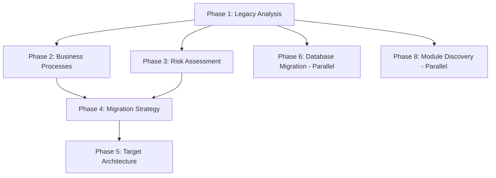

# 🚀 Quick Start Templates for AI Agent Execution

Copy-paste these templates to execute each phase efficiently.

---

## 📋 Template 1: Phase 1 - Legacy Analysis (START HERE)

```markdown
# SmartStore.NET Migration - Phase 1: Legacy System Analysis

You are analyzing the **SmartStore.NET** eCommerce platform for migration from .NET MVC 4.7 to React.js + Node.js + Prisma.

## System Context:
- **Location**: `/workspace/Legacy-Source/`
- **Architecture**: 
  - Core: SmartStore.Core (630+ files)
  - Data: SmartStore.Data (366+ files, EF mappings)
  - Services: SmartStore.Services (583+ files)
  - Web: SmartStore.Web (32 controllers, 677 Razor views)
- **Database**: SQL Server with 130+ tables
- **Key Files**: SmartStoreNET.sln

## Your Task:
Perform comprehensive legacy system analysis as defined in **PROMPT 1** from the master migration document.

## Specific Analysis Requirements:

### 1. Architecture Deep Dive
- Examine project structure in SmartStoreNET.sln
- Map layer dependencies: Core → Data → Services → Web
- Document actual architecture patterns used
- Identify framework versions and configurations

### 2. Controller Analysis
Analyze all 32 controllers in `/Legacy-Source/Presentation/SmartStore.Web/Controllers/`:
- List all controller actions and routes
- Document HTTP methods and parameters
- Identify service dependencies for each controller
- Map views/ViewModels used

### 3. Service Layer Inventory
Examine `/Legacy-Source/Libraries/SmartStore.Services/`:
- Catalog all service classes and interfaces
- Document business logic patterns
- Identify external integrations (payment, shipping, etc.)
- Map service dependencies

### 4. Database Schema Analysis
Analyze `/Legacy-Source/Libraries/SmartStore.Data/`:
- Document all EF entities and mappings
- Examine SQL files in `/Sql/` directory
- Count and categorize tables
- Document stored procedures and indexes

### 5. UI Component Audit
Examine `/Legacy-Source/Presentation/SmartStore.Web/`:
- Catalog Razor views and partial views
- Document JavaScript libraries used
- Identify CSS frameworks (Bootstrap, custom)
- List HTML helpers and custom helpers

### 6. Technology Dependencies
- Extract all NuGet packages from .csproj files
- Document framework versions (.NET 4.7, MVC, EF)
- Identify third-party libraries
- Note deprecated or obsolete packages

## Deliverables:
Create these files in `/workspace/Migration/Docs/01-Legacy-Analysis/`:

1. **System-Architecture-Assessment.md**
   - Architecture diagrams (use Mermaid syntax)
   - Layer dependencies
   - Project structure
   - Design patterns identified

2. **Technology-Stack-Audit.md**
   - Complete NuGet package inventory
   - Framework versions
   - Third-party integrations
   - Deprecated technologies to replace

3. **Code-Quality-Report.md**
   - Code complexity metrics
   - Technical debt areas
   - Code smell patterns
   - Refactoring opportunities

4. **Database-Schema-Documentation.md**
   - Table count and categories
   - Entity relationships
   - Stored procedures inventory
   - Index strategy

5. **UI-Component-Catalog.md**
   - Razor view inventory
   - JavaScript library catalog
   - CSS framework usage
   - Component reusability analysis

## Output Format:
- Use markdown with clear sections
- Include code examples from actual codebase
- Use Mermaid diagrams where appropriate
- Be specific, not generic

## Begin Analysis Now
Start by examining the solution file, then systematically analyze each layer.
```

---

## 📋 Template 2: Phase 6 - Database Migration (Can Run in Parallel)

```markdown
# SmartStore.NET Migration - Phase 6: Database Migration Planning

## Context:
Migrating SmartStore.NET database from Entity Framework to **Prisma ORM** for Node.js, retaining SQL Server.

## Database Location:
- **EF Entities**: `/workspace/Legacy-Source/Libraries/SmartStore.Data/Domain/`
- **Mappings**: `/workspace/Legacy-Source/Libraries/SmartStore.Data/Mapping/`
- **SQL Scripts**: `/workspace/Legacy-Source/Libraries/SmartStore.Data/Sql/`

## Your Task:
Execute **PROMPT 6** from master migration document.

## Specific Objectives:

### 1. Complete Schema Analysis
- Examine all EF entity classes
- Document table relationships and cardinality
- Identify composite keys, foreign keys, indexes
- Catalog navigation properties

### 2. Prisma Schema Generation
Generate `schema.prisma` file with:
- All 130+ tables converted to Prisma models
- Relationships (@relation directives)
- Indexes (@index, @@index)
- Constraints (unique, default values)
- Custom types (enums)

### 3. Stored Procedure Conversion
For each stored procedure in `/Sql/StoredProcedures.sql`:
- Document purpose and logic
- Propose conversion strategy:
  - Move to Node.js business logic
  - Keep as Prisma raw query
  - Convert to Prisma query builder
- Provide conversion examples

### 4. Data Migration Strategy
- ETL process design
- Data validation approach
- Migration script templates
- Rollback procedures
- Zero-downtime migration approach

### 5. Performance Optimization
- Index strategy for Prisma
- Query optimization patterns
- Connection pooling configuration
- Caching strategy (Redis integration)

## Deliverables:
Create in `/workspace/Migration/Docs/06-Database-Migration/`:

1. **Database-Migration-Plan.md**
   - Overall migration approach
   - Timeline and phases
   - Risk mitigation
   - Testing strategy

2. **Schema-Data-Transformation.md**
   - Complete Prisma schema
   - EF to Prisma mapping guide
   - Data type conversions
   - Migration scripts (example templates)

3. **Performance-Optimization-Strategy.md**
   - Index recommendations
   - Query optimization patterns
   - Connection pooling setup
   - Caching architecture

## Key Requirements:
- Prisma schema must be production-ready
- All relationships must be correctly mapped
- Performance must match or exceed EF
- Zero data loss guarantee

## Begin Analysis Now
Start by examining EF entities in the Domain folder.
```

---

## 📋 Template 3: Checkpoint Validation

```markdown
# Phase [N] Output Validation

## Phase Completed: [PHASE_NAME]

## Quick Validation Checklist:

### 1. Completeness Check
- [ ] All required deliverable files created?
- [ ] All sections in each file completed?
- [ ] No "TODO" or placeholder text?

### 2. Quality Check
- [ ] Analysis includes actual code examples from codebase?
- [ ] Specific file paths and class names referenced?
- [ ] Findings are SmartStore.NET-specific (not generic)?
- [ ] Technical depth sufficient for developers?

### 3. Accuracy Check
- [ ] Claims verified against actual code?
- [ ] No assumptions without code evidence?
- [ ] Dependencies correctly identified?
- [ ] Architecture patterns correctly named?

### 4. Usability Check
- [ ] Can development team use this immediately?
- [ ] Clear action items provided?
- [ ] Examples and templates included?
- [ ] No ambiguous recommendations?

## Issues Found:
[List problems here]

## Required Refinements:
[What needs to be improved]

## Approval Status:
- [ ] Approved - Ready for next phase
- [ ] Needs Minor Revisions
- [ ] Needs Major Rework

## Action Items Before Next Phase:
1. [Action item 1]
2. [Action item 2]
```

---

## 📋 Template 4: Request Deeper Analysis

Use this when AI output is too shallow:

```markdown
# Request for Deeper Analysis - Phase [N]

Your previous analysis was helpful but needs more depth. Please re-analyze with these specific requirements:

## Areas Needing Deeper Analysis:

### 1. [Specific Area - e.g., "CatalogController"]
**Current Output**: [Summary of what AI provided]
**Problem**: Too generic, lacks code examples
**Required Depth**: 
- Show actual method signatures from CatalogController.cs
- Document specific service dependencies with code examples
- Trace actual execution flow with line references
- Provide real route mappings

Example format:
```csharp
// CatalogController.cs - Lines 45-67
public ActionResult Category(int categoryId, CatalogPagingFilteringModel command)
{
    var category = _categoryService.GetCategoryById(categoryId); // ← Service dependency
    // ... show actual code flow
}
```

### 2. [Another Area]
[Same format as above]

## Specific Files to Analyze:
- `/path/to/specific/file1.cs`
- `/path/to/specific/file2.cs`

## Required Output Format:
- Include code snippets with line numbers
- Reference actual class/method names
- Show real configuration examples
- Provide concrete migration recommendations

Please re-analyze with this depth and specificity.
```

---

## 📋 Template 5: Context Carrying Between Phases

```markdown
# SmartStore.NET Migration - Phase [N]: [PHASE_NAME]

## Context from Previous Phases:

### Phase 1 Key Findings:
[Bullet points of key findings from Phase 1]
- Architecture: [Summary]
- Controllers: [List]
- Services: [Key services]
- Database: [Schema summary]

### Phase 2 Key Findings:
[If applicable]
- Business workflows identified
- Critical business rules
- User journey patterns

### [Other Relevant Phase Findings]

## Reference Documents:
- Phase 1: `/workspace/Migration/Docs/01-Legacy-Analysis/System-Architecture-Assessment.md`
- Phase 1: `/workspace/Migration/Docs/01-Legacy-Analysis/Database-Schema-Documentation.md`
- [Other relevant docs]

## Current Phase [N] Objectives:
[Copy specific phase prompt]

## Build Upon Previous Analysis:
Your analysis should:
- Reference findings from Phase [X]
- Extend insights from Phase [Y]
- Align with decisions made in Phase [Z]

## Begin Analysis
[Specific instructions for current phase]
```

---

## 📋 Template 6: Parallel Execution Coordination

When running multiple phases in parallel:

```markdown
# Parallel Execution Tracker

## Currently Running:

### Agent A - Phase 1: Legacy Analysis
**Status**: In Progress (Hour 2/4)
**Focus**: Controller and service layer analysis
**ETA**: 2 hours remaining

### Agent B - Phase 6: Database Migration
**Status**: In Progress (Hour 1/3)
**Focus**: EF to Prisma schema generation
**ETA**: 2 hours remaining

### Agent C - Phase 8: Module Discovery
**Status**: Queued
**Waiting for**: Phase 1 to reach 50% (controller analysis complete)
**Can Start**: When controller list is available

## Dependencies Map:


## Coordination Points:
- **Checkpoint 1** (2 hours): Phase 1 controller analysis → Start Phase 8
- **Checkpoint 2** (4 hours): Phase 1 complete → Start Phase 2 & 3
- **Checkpoint 3** (6 hours): Phase 2 & 3 complete → Start Phase 4

## Shared Context:
Files that multiple agents need access to:
- `/workspace/Migration/Docs/01-Legacy-Analysis/System-Architecture-Assessment.md` (for all subsequent phases)
- `/workspace/Migration/Docs/01-Legacy-Analysis/Database-Schema-Documentation.md` (for Phase 6)
```

---

## 📋 Template 7: Final Phase - Implementation Prompts Generation

```markdown
# SmartStore.NET Migration - Phase 11: Implementation Prompts

## Context:
You have completed Phases 1-10. Now create step-by-step implementation prompts for developers.

## Input Context (Review These First):
- Phase 1: `/workspace/Migration/Docs/01-Legacy-Analysis/`
- Phase 5: `/workspace/Migration/Docs/05-Target-Architecture/`
- Phase 6: `/workspace/Migration/Docs/06-Database-Migration/`
- Phase 8: `/workspace/Migration/Docs/08-Module-Analysis/`

## Your Task:
Create **copy-paste ready** implementation prompts for developers to execute the migration.

## Format for Each Implementation Prompt:

### Prompt Template:
```markdown
## Implementation Task [N]: [Task Name]

**Objective**: [What this task accomplishes]

**Prerequisites**: 
- [What must be done before this]
- [Required tools/access]

**Step-by-Step Instructions**:

1. **Setup**
   ```bash
   # Command to run
   ```
   
2. **Implementation**
   ```typescript
   // Code example
   ```

3. **Testing**
   ```bash
   # Test command
   ```

**Validation**:
- [ ] Checklist item 1
- [ ] Checklist item 2

**Expected Output**: [What success looks like]

**Common Issues & Solutions**:
- Issue 1: [Solution]
- Issue 2: [Solution]
```

## Implementation Areas to Cover:

### 1. Infrastructure Setup Prompts (8-10 prompts)
- Development environment setup
- Node.js and npm/yarn configuration
- React app initialization
- Prisma setup and database connection
- Authentication infrastructure (JWT)
- Testing framework setup
- CI/CD pipeline configuration

### 2. Database Migration Prompts (10-12 prompts)
- Prisma schema implementation (per domain area)
- Migration script creation
- Data seeding scripts
- Stored procedure conversion (per procedure)
- Index creation
- Database testing setup

### 3. Backend API Prompts (32 prompts - one per controller)
For each controller (e.g., CatalogController):
```markdown
## Implement Catalog API Endpoints

**Source**: SmartStore.Web/Controllers/CatalogController.cs

**API Endpoints to Create**:
1. GET /api/catalog/categories
2. GET /api/catalog/products/:id
3. POST /api/catalog/search
[... all endpoints from controller]

**Implementation**:
[Detailed code with Node.js/Express/Prisma]

**Business Logic Migration**:
[Convert C# service logic to TypeScript]

**Testing**:
[Unit and integration test examples]
```

### 4. Frontend Component Prompts (Major modules)
For each major UI module:
```markdown
## Implement Product Catalog UI

**Source Razor Views**:
- /Views/Catalog/Category.cshtml
- /Views/Catalog/Product.cshtml

**React Components to Create**:
1. ProductCatalog (container)
2. CategoryList (component)
3. ProductCard (component)
4. ProductFilters (component)

**Implementation**:
[React/TypeScript code]

**State Management**:
[Redux/Context setup]

**API Integration**:
[Hooks for API calls]
```

### 5. Integration & Testing Prompts (8-10 prompts)
- API integration testing
- E2E testing setup
- Performance testing
- Security testing
- Data migration validation

## Deliverables:
Create in `/workspace/Migration/Docs/11-Implementation-Guide/`:

1. **Infrastructure-Foundation-Setup-Prompts.md** (8-10 prompts)
2. **Backend-API-Implementation-Prompts.md** (32+ prompts)
3. **Frontend-UI-Migration-Prompts.md** (20+ prompts)
4. **Integration-Testing-Implementation-Prompts.md** (8-10 prompts)

## Quality Requirements:
Each prompt must be:
- ✅ Copy-paste ready with no modifications needed
- ✅ Include complete code examples
- ✅ Have validation checklist
- ✅ Include troubleshooting section
- ✅ Specify expected time to complete

## Begin Creating Implementation Prompts
Start with infrastructure setup prompts, then move to database, backend, frontend, and testing.
```

---

## 🎯 Usage Instructions

1. **Start with Template 1** (Phase 1 - Legacy Analysis)
2. **Use Template 3** after each phase to validate quality
3. **Use Template 4** if output is too shallow
4. **Use Template 5** when moving to next phase that depends on previous phases
5. **Use Template 6** if running parallel agents
6. **Use Template 7** for final implementation phase

---

## 💡 Pro Tips

### Tip 1: Always Be Specific
❌ **Bad**: "Analyze the controllers"
✅ **Good**: "Analyze all 32 controllers in `/workspace/Legacy-Source/Presentation/SmartStore.Web/Controllers/`, specifically documenting action methods, service dependencies, and route mappings"

### Tip 2: Request Code Examples
Add to every prompt:
```markdown
**Code Evidence Required**: 
Include actual code snippets from the codebase with file paths and line numbers to support your findings.
```

### Tip 3: Set Clear Success Criteria
```markdown
**This phase is complete when**:
- [ ] All 5 deliverable files created
- [ ] Each file contains specific SmartStore.NET code examples
- [ ] Architecture diagrams are in Mermaid syntax
- [ ] A developer can understand the system without reading code
```

### Tip 4: Iterative Refinement
Don't expect perfection on first pass. Use this pattern:
1. Run phase prompt
2. Review output (use Template 3)
3. Request deeper analysis (use Template 4)
4. Validate again
5. Move to next phase

---

## ⏱️ Time Estimates

| Phase | Template | Est. Time | Validation | Total |
|-------|----------|-----------|------------|-------|
| Phase 1 | Template 1 | 3-4 hours | 30 min | 3.5-4.5h |
| Phase 2 | Template 5 | 1-2 hours | 20 min | 1.5-2.5h |
| Phase 3 | Template 5 | 1 hour | 15 min | 1.25h |
| Phase 4 | Template 5 | 2 hours | 30 min | 2.5h |
| Phase 5 | Template 5 | 3-4 hours | 45 min | 4-5h |
| Phase 6 | Template 2 | 2-3 hours | 30 min | 2.5-3.5h |
| Phase 7 | Template 5 | 1-2 hours | 20 min | 1.5-2.5h |
| Phase 8 | Template 5 | 3-4 hours | 45 min | 4-5h |
| Phase 9 | Template 5 | 3-4 hours | 45 min | 4-5h |
| Phase 10 | Template 5 | 2-3 hours | 30 min | 2.5-3.5h |
| Phase 11 | Template 7 | 4-6 hours | 1 hour | 5-7h |
| Phase 12 | Template 5 | 1-2 hours | 20 min | 1.5-2.5h |
| **TOTAL** | | **26-37 hours** | **6.5 hours** | **32.5-43.5h** |

---

## 🚀 Ready to Start?

**Copy Template 1 above and paste it to your AI agent to begin Phase 1 analysis now!**
