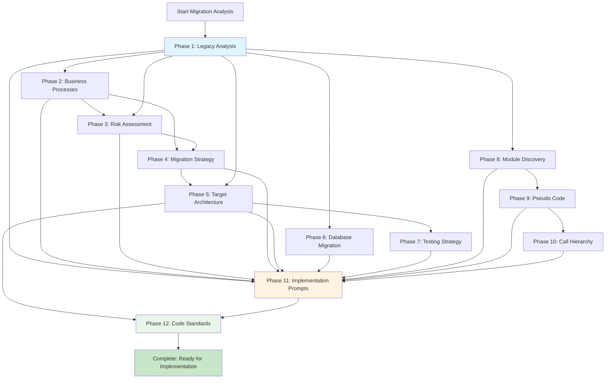

# 📊 Visual Execution Guide - SmartStore.NET Migration

Quick visual reference for executing the 12-phase migration analysis.

---

## 🚫 WRONG: Passing All Prompts At Once

```
┌─────────────────────────────────────────┐
│  AI Agent                               │
│                                         │
│  Input: All 12 prompts + entire        │
│         codebase (2000+ files)         │
│                                         │
│  Result: ❌ Shallow analysis            │
│          ❌ Generic outputs             │
│          ❌ Missing critical details    │
│          ❌ Context overflow            │
│          ❌ Unusable documentation      │
└─────────────────────────────────────────┘
```

**Outcome**: Waste of time, unusable outputs

---

## ✅ CORRECT: Orchestrated Sequential Execution

```
┌──────────────┐
│  Phase 1     │  Deep analysis of legacy system
│  (3-4 hours) │  → 5 comprehensive documents
└──────┬───────┘
       │ outputs become input ↓
┌──────▼───────┐
│  Phase 2     │  Business process extraction
│  (1-2 hours) │  → 3 documents (uses Phase 1)
└──────┬───────┘
       │ outputs become input ↓
┌──────▼───────┐
│  Phase 3     │  Risk assessment
│  (1 hour)    │  → 3 documents (uses Phase 1,2)
└──────┬───────┘
       │ outputs become input ↓
       ⋮
┌──────▼───────┐
│  Phase 12    │  Code standards
│  (1-2 hours) │  → 4 documents (uses all previous)
└──────────────┘
```

**Outcome**: High-quality, actionable documentation

---

## 📅 Timeline Visualization

### Sequential Approach (4-5 weeks)

```
Week 1: Foundation Analysis
├─ Monday-Tuesday     │█████████│ Phase 1: Legacy Analysis
├─ Wednesday          │████│     Phase 2: Business Processes  
├─ Thursday           │███│      Phase 3: Risk Assessment
└─ Friday             │█████│    Phase 4: Migration Strategy

Week 2: Architecture Design
├─ Monday-Tuesday     │██████████│ Phase 5: Target Architecture
├─ Wednesday-Thursday │████████│   Phase 6: Database Migration
└─ Friday             │████│       Phase 7: Testing Strategy

Week 3: Deep Code Analysis
├─ Monday-Wednesday   │███████████│ Phase 8: Module Discovery
└─ Thursday-Friday    │████████│   Phase 9: Pseudo Code

Week 4: Implementation Planning
├─ Monday-Tuesday     │███████│    Phase 10: Call Hierarchy
├─ Wednesday-Thursday │████████████│ Phase 11: Implementation Prompts
└─ Friday             │████│       Phase 12: Code Standards

Week 5: Validation & Refinement
└─ Review, validate, and refine all outputs
```

---

### Parallel Approach (2-3 weeks)

```
Week 1: Parallel Wave 1
Agent A │████████████│ Phase 1: Legacy Analysis
Agent B │████████│     Phase 6: Database Migration
Agent C │███████████│  Phase 8: Module Discovery

Week 2: Parallel Wave 2 & 3
Agent A │█████│██████│  Phase 2 → Phase 3
Agent B │█████████│    Phase 5: Target Architecture
Agent C │████████│     Phase 9: Pseudo Code

Week 3: Sequential Final Phases
Agent A │██████│███████████│███│  Phase 10 → 11 → 12
```

---

## 🔄 Dependency Flow Diagram



---

## 📊 Input/Output Flow

### Phase 1 Example

```
┌─────────────────────────────────────────────────┐
│ INPUT: Template 1 Prompt + SmartStore Codebase │
└────────────────┬────────────────────────────────┘
                 │
                 ▼
         ┌───────────────┐
         │   AI Agent    │
         │   Analysis    │
         │   (3-4 hours) │
         └───────┬───────┘
                 │
                 ▼
┌────────────────────────────────────────────────┐
│ OUTPUT: 5 Comprehensive Documents              │
├────────────────────────────────────────────────┤
│ 1. System-Architecture-Assessment.md           │
│    - Layer dependencies                        │
│    - Architecture diagrams                     │
│    - Design patterns                           │
│                                                 │
│ 2. Technology-Stack-Audit.md                   │
│    - NuGet packages (with versions)           │
│    - Framework dependencies                    │
│    - Third-party integrations                  │
│                                                 │
│ 3. Code-Quality-Report.md                      │
│    - Complexity metrics                        │
│    - Technical debt areas                      │
│    - Refactoring opportunities                 │
│                                                 │
│ 4. Database-Schema-Documentation.md            │
│    - All 130+ tables cataloged                │
│    - ER diagrams                               │
│    - Stored procedures inventory               │
│                                                 │
│ 5. UI-Component-Catalog.md                     │
│    - All 677 Razor views cataloged            │
│    - JavaScript libraries                      │
│    - CSS framework usage                       │
└────────────────────────────────────────────────┘
```

---

## 🎯 Quality Gate Process

```
┌─────────────────┐
│  Phase Complete │
└────────┬────────┘
         │
         ▼
┌─────────────────────────────────┐
│  Validation Checkpoint          │
│  (Template 3)                   │
│                                 │
│  ✓ All deliverables created?   │
│  ✓ Specific code examples?     │
│  ✓ Actionable for developers?  │
│  ✓ Technically accurate?        │
└────────┬───────────┬────────────┘
         │           │
    ✅ Pass      ❌ Fail
         │           │
         ▼           ▼
    ┌─────────┐  ┌──────────────┐
    │  Next   │  │  Refinement  │
    │  Phase  │  │  Required    │
    └─────────┘  └──────┬───────┘
                        │
                        ▼
                 ┌──────────────┐
                 │  Use Template│
                 │  4: Request  │
                 │  Deeper      │
                 │  Analysis    │
                 └──────┬───────┘
                        │
                        ▼
                 ┌──────────────┐
                 │  Re-analyze  │
                 │  Phase       │
                 └──────────────┘
```

---

## 🔢 File Generation Progress

```
Total Documentation: 44+ Files

Phase 1  │█████│ (5 files)   [11%]  ✓
Phase 2  │███│   (3 files)   [18%]  ✓
Phase 3  │███│   (3 files)   [25%]  ✓
Phase 4  │████│  (4 files)   [34%]  ✓
Phase 5  │█████│ (5 files)   [45%]  ⏳ In Progress
Phase 6  │███│   (3 files)   [52%]  ⏸️ Not Started
Phase 7  │████│  (4 files)   [61%]  ⏸️ Not Started
Phase 8  │███│   (3 files)   [68%]  ⏸️ Not Started
Phase 9  │███│   (3 files)   [75%]  ⏸️ Not Started
Phase 10 │███│   (3 files)   [82%]  ⏸️ Not Started
Phase 11 │████│  (4 files)   [91%]  ⏸️ Not Started
Phase 12 │████│  (4 files)   [100%] ⏸️ Not Started

Legend: ✓ Complete | ⏳ In Progress | ⏸️ Not Started | ❌ Blocked
```

---

## 🎬 Step-by-Step Visual Workflow

### Step 1: Choose Strategy

```
┌───────────────────────────────────────────────┐
│  How Many People Working on This?            │
├───────────────────────────────────────────────┤
│                                               │
│  👤 Just Me (1 person)                        │
│  └─→ Use SEQUENTIAL Strategy                 │
│      Time: 4-5 weeks                          │
│                                               │
│  👥 Small Team (2-3 people)                   │
│  └─→ Use HYBRID Strategy                     │
│      Time: 3-4 weeks                          │
│                                               │
│  👥👥 Large Team (3+ people)                   │
│  └─→ Use PARALLEL Strategy                   │
│      Time: 2-3 weeks                          │
│                                               │
└───────────────────────────────────────────────┘
```

---

### Step 2: Start Phase 1

```
┌────────────────────────────────────────┐
│  1. Open QUICK-START-TEMPLATES.md     │
└───────────────┬────────────────────────┘
                │
                ▼
┌────────────────────────────────────────┐
│  2. Copy Template 1                   │
│     (Phase 1: Legacy Analysis)        │
└───────────────┬────────────────────────┘
                │
                ▼
┌────────────────────────────────────────┐
│  3. Paste to AI Agent                 │
│     (Claude, GPT-4, etc.)             │
└───────────────┬────────────────────────┘
                │
                ▼
┌────────────────────────────────────────┐
│  4. Wait 3-4 hours                    │
│     AI analyzes codebase              │
└───────────────┬────────────────────────┘
                │
                ▼
┌────────────────────────────────────────┐
│  5. Validate Output                   │
│     Use Template 3                    │
└───────────────┬────────────────────────┘
                │
           ┌────┴────┐
           │         │
        Good?      Bad?
           │         │
           ▼         ▼
    ┌──────────┐  ┌─────────────┐
    │ Phase 2  │  │ Refinement  │
    │          │  │ (Template 4)│
    └──────────┘  └─────────────┘
```

---

### Step 3: Continue Through Phases

```
Phase 1 ✅ → Phase 2 ⏳ → Phase 3 ⏸️ → ... → Phase 12 ⏸️

Each phase:
1. Copy appropriate template
2. Provide context from previous phases
3. Let AI analyze
4. Validate output
5. Move to next phase
```

---

## 💾 File System Changes

### Before Starting

```
/workspace/
├── Legacy-Source/     (2000+ files)
├── Migration/
│   └── Docs/         (14 existing files)
└── README.md
```

### After Phase 1

```
/workspace/
├── Legacy-Source/     (2000+ files)
├── Migration/
│   └── Docs/
│       ├── 01-Legacy-Analysis/    ← NEW! (5 files)
│       │   ├── System-Architecture-Assessment.md
│       │   ├── Technology-Stack-Audit.md
│       │   ├── Code-Quality-Report.md
│       │   ├── Database-Schema-Documentation.md
│       │   └── UI-Component-Catalog.md
│       └── [existing files]
└── README.md
```

### After All 12 Phases

```
/workspace/
├── Legacy-Source/     (2000+ files)
├── Migration/
│   └── Docs/
│       ├── 01-Legacy-Analysis/         (5 files) ✅
│       ├── 02-Business-Processes/      (3 files) ✅
│       ├── 03-Risk-Assessment/         (3 files) ✅
│       ├── 04-Migration-Strategy/      (4 files) ✅
│       ├── 05-Target-Architecture/     (5 files) ✅
│       ├── 06-Database-Migration/      (3 files) ✅
│       ├── 07-Testing-Strategy/        (4 files) ✅
│       ├── 08-Module-Analysis/         (3 files) ✅
│       ├── 09-Pseudo-Code/             (3 files) ✅
│       ├── 10-Call-Hierarchy/          (3 files) ✅
│       ├── 11-Implementation-Guide/    (4 files) ✅
│       └── 12-Code-Standards/          (4 files) ✅
└── README.md

Total: 44+ comprehensive documentation files
```

---

## 📈 Progress Dashboard Visualization

```
┌──────────────────────────────────────────────────────┐
│  SmartStore.NET Migration Analysis Progress         │
├──────────────────────────────────────────────────────┤
│                                                      │
│  Overall Progress:  ████████████░░░░░░░░  45%      │
│                                                      │
│  Time Invested:     18 hours / 40 hours             │
│  Files Created:     20 files / 44 files             │
│  Current Phase:     Phase 5 (In Progress)           │
│  ETA:              22 hours remaining                │
│                                                      │
├──────────────────────────────────────────────────────┤
│  Phase Breakdown:                                    │
│                                                      │
│  ✅ Phase 1:  ████████████████████  100% (4.0h)    │
│  ✅ Phase 2:  ████████████████████  100% (1.5h)    │
│  ✅ Phase 3:  ████████████████████  100% (1.0h)    │
│  ✅ Phase 4:  ████████████████████  100% (2.5h)    │
│  ⏳ Phase 5:  ██████████░░░░░░░░░   55% (2.0h)     │
│  ⏸️ Phase 6:  ░░░░░░░░░░░░░░░░░░░    0% (0.0h)     │
│  ⏸️ Phase 7:  ░░░░░░░░░░░░░░░░░░░    0% (0.0h)     │
│  ⏸️ Phase 8:  ░░░░░░░░░░░░░░░░░░░    0% (0.0h)     │
│  ⏸️ Phase 9:  ░░░░░░░░░░░░░░░░░░░    0% (0.0h)     │
│  ⏸️ Phase 10: ░░░░░░░░░░░░░░░░░░░    0% (0.0h)     │
│  ⏸️ Phase 11: ░░░░░░░░░░░░░░░░░░░    0% (0.0h)     │
│  ⏸️ Phase 12: ░░░░░░░░░░░░░░░░░░░    0% (0.0h)     │
│                                                      │
└──────────────────────────────────────────────────────┘
```

---

## 🎯 Success Visualization

### What Good Output Looks Like

```
❌ BAD OUTPUT (Generic):
┌─────────────────────────────────────┐
│ "The system uses MVC pattern and    │
│  has controllers that handle HTTP   │
│  requests. Services contain business│
│  logic. Database uses Entity        │
│  Framework."                        │
└─────────────────────────────────────┘
Problem: Too generic, no specifics

✅ GOOD OUTPUT (Specific):
┌─────────────────────────────────────────────────────┐
│ "CatalogController (Lines 45-120) handles product  │
│  catalog display. It depends on:                    │
│                                                      │
│  1. ICategoryService (injected via constructor)    │
│  2. IProductService (injected via constructor)     │
│  3. ICacheManager (for performance)                │
│                                                      │
│  Key Routes:                                        │
│  - GET /catalog/category/{id}                      │
│  - GET /catalog/product/{id}                       │
│  - POST /catalog/search                            │
│                                                      │
│  Example Code (CatalogController.cs:67-82):       │
│  ```csharp                                          │
│  public ActionResult Category(int id) {            │
│      var category = _categoryService               │
│          .GetCategoryById(id);                     │
│      // ... actual code                            │
│  }                                                  │
│  ```                                                │
│                                                      │
│  Migration Note: Convert to REST API endpoint      │
│  GET /api/categories/:id with Express handler"    │
└─────────────────────────────────────────────────────┘
```

---

## 🚀 Quick Reference Card

```
┌─────────────────────────────────────────────────────┐
│  QUICK REFERENCE: Starting Right Now               │
├─────────────────────────────────────────────────────┤
│                                                     │
│  1. Read:  README-START-HERE.md          (10 min) │
│  2. Choose: Sequential/Parallel/Hybrid    (5 min) │
│  3. Open:  QUICK-START-TEMPLATES.md       (2 min) │
│  4. Copy:  Template 1 (Phase 1)           (2 min) │
│  5. Paste: To AI Agent                    (1 min) │
│  6. Wait:  AI Analysis                  (3-4 hrs) │
│  7. Validate: Use Template 3             (30 min) │
│  8. Continue: To Phase 2                     (→)  │
│                                                     │
│  Total Time to Start: 20 minutes                   │
│  Your First Output: 3-4 hours from now            │
│                                                     │
└─────────────────────────────────────────────────────┘
```

---

## 📞 When You Need Help

```
┌────────────────────────────────────────────────────┐
│  Common Issues & Solutions                         │
├────────────────────────────────────────────────────┤
│                                                    │
│  Issue: Output too generic                        │
│  Solution: Use Template 4 (Request Deeper)        │
│                                                    │
│  Issue: Don't understand dependencies             │
│  Solution: Check dependency diagram in this file  │
│                                                    │
│  Issue: Taking too long                           │
│  Solution: First phase always slower, gets faster │
│                                                    │
│  Issue: Quality concerns                          │
│  Solution: Use Template 3 validation checklist    │
│                                                    │
└────────────────────────────────────────────────────┘
```

---

**Next Action**: Open `/workspace/Migration/README-START-HERE.md` and begin!
